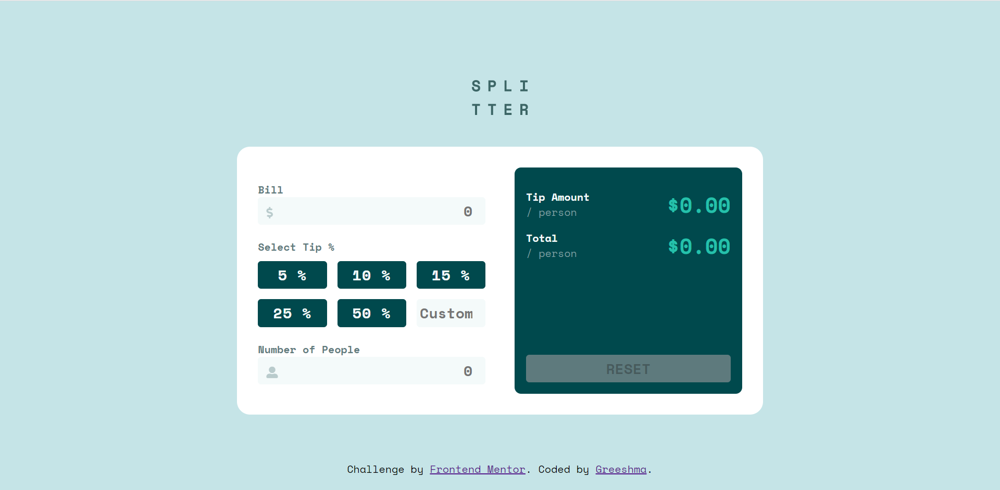
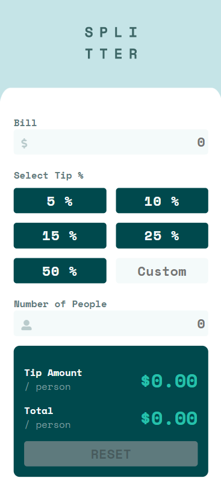

# Frontend Mentor - Tip calculator app solution

This is a solution to the [Tip calculator app challenge on Frontend Mentor](https://www.frontendmentor.io/challenges/tip-calculator-app-ugJNGbJUX). Frontend Mentor challenges help you improve your coding skills by building realistic projects.

## Table of contents

- [Overview](#overview)
  - [The challenge](#the-challenge)
  - [Screenshot](#screenshot)
  - [Links](#links)
- [My process](#my-process)
  - [Built with](#built-with)
  - [What I learned](#what-i-learned)
  - [Useful resources](#useful-resources)
- [Author](#author)
- [Acknowledgments](#acknowledgments)


## Overview

### The challenge

Users should be able to:

- View the optimal layout for the app depending on their device's screen size
- See hover states for all interactive elements on the page
- Calculate the correct tip and total cost of the bill per person

### Screenshot



<div>

  

</div>

### Links

- Solution URL: https://github.com/Greeshma2903/tip-calculator-app/
- Live Site URL: http://tip-calculator-app-opal.vercel.app/

## My process

This was a really interesting Challenge especially because of the JS part. Just like other challenges, i chose mobile first approach 📱. 

For the first time I faced some HTML challenges (choosing between form fields or just regular para/heading) but bigger than that was the JS part. The challenge for me was how to read values from the fields after user inputs the proper value (and not NaN). But I figured it out by using the "change" event listener on all input fields.🤔

I also tried to make the page more accessible (🤞)
### Built with

- Semantic HTML5 markup
- CSS custom properties
- Flexbox
- CSS Grid
- Mobile-first workflow
- Vanilla JS

### What I learned

- Learnt about more [Event listeners](https://developer.mozilla.org/en-US/docs/Web/Events) & [Pesudo Classes](https://developer.mozilla.org/en-US/docs/Web/CSS/Pseudo-classes) (shoutout to MDN Docs for providing such great documentation 🤩)
- ✅ Learnt to declare all functions at top of Script


```html
<!-- I liked the forms in this one -->
<input class="input-field" type="number" name="number-people" id="people-count" placeholder="0" aria-label="enter-number-of-people" required aria-required="The number of people cannot be 0" min="0" max="100" />
```

### Useful resources

- [MDN: Event Listeners](https://developer.mozilla.org/en-US/docs/Web/Events)
- [MDN: Pseudo classes](https://developer.mozilla.org/en-US/docs/Web/Events)
- [How to add Font Awesome Icons using CSS pseudo elements](https://fontawesome.com/v5.15/how-to-use/on-the-web/advanced/css-pseudo-elements)
- [Aria labels for accessibility](https://www.aditus.io/aria/aria-label/)

## Author

- Website - [Greeshma](https://greeshma-portfolio.netlify.app/)
- Frontend Mentor - [@Greeshma2903](https://www.frontendmentor.io/profile/Greeshma2903)
- Twitter - [@GreeshmaMedam](https://www.twitter.com/GreeshmaMedam)

## Acknowledgments

I referred to [ellienndea's](https://github.com/ellienndea/tip-calculator-app) solution to understand her approach on making buttons clickable (like checkboxes) and how the calculator needs to function. Her approach is really good one, and she also essentially used form inputs, which inspired me to do the same (as I thought it would be more accessible too 😊)
